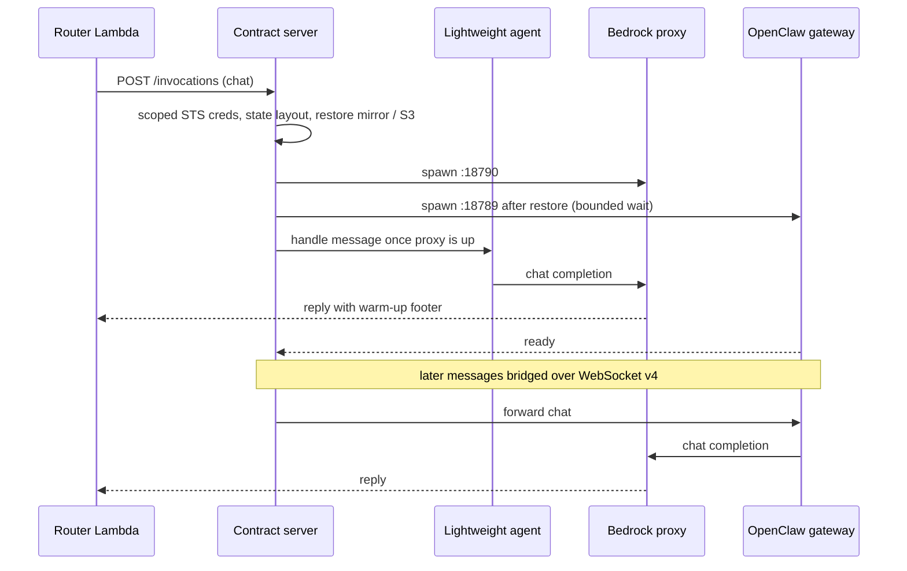

# How It Works

Reference for how the deployment behaves at runtime. Moved out of the [README](../README.md); the README keeps a summary. For diagrams and data flows see [architecture-detailed.md](architecture-detailed.md).

## Components

| Component | What it is | Code |
|---|---|---|
| API Gateway HTTP API | Routes `POST /webhook/{telegram,slack,feishu}` and `GET /health`; throttled (burst 50, rate 100) | `stacks/router_stack.py` |
| Router Lambda | Webhook validation, identity resolution, image upload, `InvokeAgentRuntime`, reply delivery, typing/progress notices | `lambda/router/index.py` |
| DynamoDB `openclaw-identity` | Users, channel bindings, sessions, allowlist, link codes, `CRON#` records | `stacks/router_stack.py` |
| Contract server | AgentCore HTTP contract on port 8080 (`/ping`, `/invocations`); per-user init, state layout, gateway spawn, WebSocket bridge, best-effort SIGTERM flush | `bridge/agentcore-contract.js` |
| Lightweight agent | Warm-up agent with 17 tools (web, S3 files, schedules, ClawHub, API keys) used until the gateway is ready | `bridge/lightweight-agent.js` |
| OpenClaw gateway | `openclaw@2026.9.5` on `node:24-slim`, gateway protocol v4, `gateway-client`/`backend` identity, 5 pinned ClawHub skills + 4 custom skills from `/skills` | `bridge/Dockerfile`, `bridge/skills/` |
| Bedrock proxy | OpenAI-compatible endpoint on port 18790 → Bedrock `ConverseStream`; multimodal images, sub-agent model routing, per-user Cognito JWT | `bridge/agentcore-proxy.js` |
| Local disk `~/.openclaw` | Authoritative OpenClaw state (SQLite sessions + workspace); the NFS mount cannot hold SQLite locks or hard links | `bridge/state-storage.js` |
| Session storage `/mnt/workspace` | AgentCore managed session storage; mirror of the state dir, restored before the gateway spawns | `bridge/state-storage.js`, `scripts/deploy.sh` |
| S3 user-files bucket | Per-user files, image uploads, screenshots, and `~/.openclaw` snapshots (SQLite via online backup). Versioned; noncurrent versions expire after 30 days (the newest 3 per key are kept) and incomplete multipart uploads are aborted after 7 days | `stacks/agentcore_stack.py`, `bridge/workspace-sync.js` |
| STS scoped credentials | Execution role re-assumed with a session policy limiting S3, DynamoDB, Secrets Manager and Scheduler to the user's namespace | `bridge/scoped-credentials.js` |
| Cognito User Pool | Per-user Cognito user with an HMAC-derived password; the proxy acquires and caches an ID token per user. With `enable_gateway: true` the contract server mints the same user's **access** token as the bearer for the Gateway MCP server | `stacks/security_stack.py`, `bridge/agentcore-proxy.js`, `bridge/cognito-token.js` |
| Secrets Manager | `openclaw/gateway-token`, `openclaw/channels/*`, `openclaw/webhook-secret`, `openclaw/cognito-password-secret`, per-user `openclaw/user/{ns}/*` | `stacks/security_stack.py`, `bridge/skills/api-keys/` |
| KMS CMK | Encrypts S3, DynamoDB, SNS and Secrets Manager | `stacks/security_stack.py` |
| EventBridge Scheduler + Cron Lambda | Schedule group `openclaw-cron`; `openclaw-cron-executor` warms the session, sends the `cron` action and posts the reply to Telegram, Slack or Feishu | `stacks/cron_stack.py`, `lambda/cron/index.py`, `bridge/skills/eventbridge-cron/` |
| Token monitoring | Bedrock invocation logs → CloudWatch subscription → `token_metrics` Lambda → DynamoDB (3 GSIs) + custom metrics, dashboards, budget alarms, SNS | `stacks/observability_stack.py`, `stacks/token_monitoring_stack.py`, `lambda/token_metrics/index.py` |
| Bedrock Guardrails (optional) | `CfnGuardrail` + version; see [Security](../README.md#security) | `stacks/guardrails_stack.py` |
| AgentCore Gateway (optional, prototype) | `enable_gateway: false` by default. When on: MCP Gateway `openclaw-tools` with a Cognito JWT authorizer, a REQUEST interceptor Lambda and two Lambda targets (`user-files`, `schedules`) that serve the file and schedule tools as typed MCP tools; see [AgentCore Gateway MCP tools](#agentcore-gateway-mcp-tools-prototype) | `stacks/gateway_stack.py`, `lambda/gateway_tools/`, `bridge/gateway-mcp.js` |
| AgentCore Browser (optional) | `CfnBrowserCustom` in the VPC, used by the `agentcore-browser` skill | `stacks/agentcore_stack.py`, `bridge/skills/agentcore-browser/` |

## CDK Stacks

| Stack | Resources | Dependencies |
|---|---|---|
| **OpenClawVpc** | VPC (2 AZ), private/public subnets, NAT, 7 interface endpoints (Bedrock Runtime, SSM, ECR API/Docker, Secrets Manager, CloudWatch Logs/Monitoring) + S3 gateway endpoint, flow logs | None |
| **OpenClawSecurity** | KMS CMK, Secrets Manager (8 secrets: gateway token, 5 channel tokens, webhook secret, Cognito password secret), Cognito User Pool + client, optional CloudTrail | None |
| **OpenClawGuardrails** | CfnGuardrail (content filters, topic denial, PII, word filters, regex), CfnGuardrailVersion | Security |
| **OpenClawAgentCore** | Execution role, security group, S3 user-files bucket, optional `CfnBrowserCustom`. The Runtime, its endpoint and the ECR repository are created by the Starter Toolkit in Phase 2; this stack only reads `runtime_id`/`runtime_endpoint_id` from `cdk.json` context | Vpc, Security, Guardrails |
| **OpenClawRouter** | Lambda, API Gateway HTTP API (`/webhook/telegram`, `/webhook/slack`, `/webhook/feishu`, `/health`; throttling), DynamoDB `openclaw-identity` table | AgentCore, Security |
| **OpenClawObservability** | Operations dashboard, alarms (errors, latency, throttles), SNS topic, Bedrock invocation logging | Security |
| **OpenClawTokenMonitoring** | DynamoDB (single-table, 3 GSIs), Lambda processor, analytics dashboard | Observability, Security |
| **OpenClawCron** | EventBridge Scheduler group `openclaw-cron`, Cron executor Lambda `openclaw-cron-executor`, Scheduler IAM role | AgentCore, Security (identity table referenced by name) |
| **OpenClawGateway** (opt-in, `enable_gateway`) | Prototype: AgentCore Gateway (MCP, Cognito JWT authorizer), REQUEST interceptor Lambda, two Lambda MCP targets for per-user files and schedules. Not instantiated with the default `enable_gateway: false`; see [docs/gateway-mcp-tools.md](gateway-mcp-tools.md) | Security |

## First-Message Startup Diagram

**Container startup on the first message of a session:**




## Why S3 Workspace Sync?

AgentCore microVMs are ephemeral — they're destroyed when idle. OpenClaw stores conversation history (per-agent SQLite databases since 2.0), user profiles, and agent configuration in the `~/.openclaw/` directory. **S3-backed workspace sync** restores this directory on session start and then uploads each changed file a few seconds after it changes (debounced 5 s, at most 30 s after the first change; when only SQLite databases changed, their snapshots go up at most every 5 min, or every 10 min for databases over 10 MB). A full save also runs every 5 min (30 min when session storage is the primary store). AgentCore gives no reliable shutdown window (on staging the container was gone well under 5 s after `SIGTERM`, and idle stops sent no `SIGTERM` at all), so the `SIGTERM` save is best effort, not the guarantee. Each `*.sqlite` file is uploaded as a consistent point-in-time snapshot (node:sqlite online backup), never as raw WAL-mode bytes; a snapshot over 10 MB is streamed gzip-compressed as an S3 multipart upload, and a database over 1 GiB (`WORKSPACE_SYNC_MAX_SQLITE_BYTES`) is skipped with a log line. The pre-2.0 session import therefore runs once: its receipt is backed up to S3 and later cold starts skip it. Each user's workspace is isolated under a unique S3 prefix derived from their channel identity.

This lets the system behave like a persistent server (continuous conversation history) while benefiting from serverless economics (no idle compute costs).

## Session Storage (Persistent Filesystem)

When [Managed Session Storage](https://docs.aws.amazon.com/bedrock-agentcore/latest/devguide/runtime-persistent-filesystems.html) is available, `~/.openclaw/` persists across stop/resume cycles via `/mnt/workspace`, with S3 as a cold backup. Configured automatically by `deploy.sh`.

The state dir is **not** placed directly on the mount. Session storage is a loopback NFS export with `local_lock=none` and no hard-link support; OpenClaw 2.0 needs both (SQLite locks for its session store, `link(2)` to publish workspace files such as `AGENTS.md`). `bridge/state-storage.js` therefore keeps `~/.openclaw/` on local disk and mirrors it onto `/mnt/workspace/.openclaw/` — the workspace within seconds of a change (debounced `fs.watch`), everything else (with each `*.sqlite` as a consistent snapshot) every 5 minutes and on `SIGTERM` — then restores the mirror to local disk before the gateway spawns on the next start. See [docs/session-storage.md](session-storage.md) and [docs/openclaw-2.0-upgrade.md](openclaw-2.0-upgrade.md).

Operators can run one-off shell commands inside a live session (health checks, workspace inspection, CI assertions) with `scripts/agentcore-exec.py`, a boto3 wrapper around `InvokeAgentRuntimeCommand`. It runs with the **full execution-role credentials**, so it is operator-only and has no chat path. See [docs/execute-command.md](execute-command.md).


## Per-User Sessions

Each user gets their own AgentCore microVM. When a user sends a message:

1. **Router Lambda** receives the webhook, resolves user identity in DynamoDB, and calls `InvokeAgentRuntime` with a per-user session ID
2. **Contract server** (port 8080) handles the invocation — on first message, it runs parallel initialization:
   - Creates STS scoped credentials restricting S3 to the user's namespace prefix
   - Starts the Bedrock proxy with `USER_ID`/`CHANNEL` env vars
   - Starts OpenClaw gateway with scoped credentials (container credentials stripped)
   - Restores `~/.openclaw/` from session storage, or from S3 when the mount is empty (awaited, bounded)
   - Starts credential refresh timer (45 min interval)
   - Waits for proxy only (~5s), then the **lightweight agent** handles the message immediately
3. **Lightweight agent** (warm-up phase; on us-west-2 staging the proxy was ready 165 ms after spawn and the first warm-up reply reached the E2E harness 23 s after the webhook) runs an agentic loop with 17 tools: `web_fetch`, `web_search`, S3 file storage (read/write/list/delete), EventBridge cron scheduling (create/list/update/delete), ClawHub skill management (install/uninstall/list), and API key management (native CRUD, Secrets Manager CRUD, unified retrieval, migration). Web tools include SSRF prevention: `web_fetch` checks every address a hostname resolves to at connect time (and IP-literal hosts), and refuses the request if any is private, loopback, link-local or otherwise blocked, so a DNS-rebinding name cannot slip through. All responses include a deterministic warm-up footer
4. **WebSocket bridge** (after OpenClaw ready; the 2.0 gateway logged `ready` 2.6 s after spawn on us-west-2 staging, but spawn itself waits for the S3 workspace restore, bounded by `WORKSPACE_RESTORE_WAIT_MS`, so the E2E harness measured 70 s from webhook to the first full-OpenClaw reply) takes over — messages route to OpenClaw which provides full tool profile, 5 ClawHub skills, and sub-agent support. Responses no longer have the warm-up footer
5. **Router Lambda** sends the response back to the channel API (Telegram, Slack or Feishu). Telegram replies are split into chunks of at most 4,000 UTF-16 code units (Telegram's 4,096 limit counts emoji as 2), cut at paragraph, line or word boundaries and outside code fences where possible; a chunk Telegram rejects is re-sent once in half-size pieces. While waiting, it sends typing indicators (Telegram) and a one-time progress message after 30s (Telegram and Slack) for long-running requests

When the session idles (default 30 min), AgentCore terminates the microVM. Changed state has normally reached S3 by then (see [Why S3 Workspace Sync?](#why-s3-workspace-sync)). If a `SIGTERM` arrives, the handler uploads pending changes, stops the gateway, snapshots `~/.openclaw/` (SQLite included) onto session storage and runs a full S3 save, all best effort. The next message creates a fresh microVM and restores the state dir from session storage (or S3 when the mount is empty).

## Image Uploads

Users can send photos alongside text messages. The system supports JPEG, PNG, GIF, and WebP images up to 3.75 MB (the Bedrock Converse API limit).

**How it works:**

1. **Router Lambda** detects an image in the incoming webhook (Telegram `photo` array or `document` with image MIME type; Slack `files` with image MIME type)
2. **Router Lambda** downloads the image from the channel API (Telegram `getFile` endpoint; Slack `url_private_download` with Bearer auth) and uploads it to S3 under `{namespace}/_uploads/img_{timestamp}_{hex}.{ext}`
3. The message payload sent to AgentCore becomes a structured object: `{"text": "caption text", "images": [{"s3Key": "...", "contentType": "image/jpeg"}]}`
4. **Contract server** converts this to a string with an appended marker: `caption text\n\n[OPENCLAW_IMAGES:[...]]`
5. **Proxy** extracts the marker, fetches the image bytes from S3 (validating the S3 key belongs to the user's namespace), and builds Bedrock multimodal content blocks
6. **Bedrock ConverseStream** receives both text and image content, enabling Claude to reason about the image

**Telegram**: Photos use the `caption` field for text (not `text`). The Router Lambda checks both. The largest photo size in the `photo` array is used.

**Slack**: The bot requires the `files:read` OAuth scope to download file attachments. Without it, images are silently ignored and only text is processed.

## Cross-Channel Account Linking

By default, each channel creates a separate user identity. If you use both Telegram and Slack, you'll have two separate sessions with separate conversation histories. To unify them into a single identity and shared session:

1. **On your first channel** (e.g., Telegram), send: `link`
   - The bot responds with an 8-character code (e.g., `A1B2C3D4`) valid for 10 minutes
2. **On your second channel** (e.g., Slack), send: `link A1B2C3D4`
   - The bot confirms the accounts are linked

After linking, both channels route to the same user, the same AgentCore session, and the same conversation history. The bind code is stored in DynamoDB with a 10-minute TTL and deleted after use.

You can link multiple channels to the same identity by repeating the process.

## Access Control (User Allowlist)

By default, the bot is **private** (`registration_open: false` in `cdk.json`). Only users on the allowlist can register. Existing users (already registered) are always allowed through.

When an unauthorized user messages the bot, they receive a rejection message that includes their channel ID:

> *Sorry, this bot is private and requires an invitation.*
> *Your ID: `telegram:123456`*
> *Send this ID to the bot admin to request access.*

**Adding users:**

```bash
# Add a user to the allowlist
./scripts/manage-allowlist.sh add telegram:123456

# Remove a user
./scripts/manage-allowlist.sh remove telegram:123456

# List all allowed users
./scripts/manage-allowlist.sh list
```

Only the first channel identity needs to be allowlisted. When a user binds a second channel (e.g. Slack) via `link`, the new channel maps to their existing approved user — no separate allowlist entry needed.

To make the bot open to everyone, set `registration_open: true` in `cdk.json` and redeploy.

## Scheduled Tasks (Cron Jobs)

The agent can create, manage, and execute **recurring scheduled tasks** using Amazon EventBridge Scheduler. Schedules persist across sessions and fire even when the user is not chatting — the response is delivered to the user's Telegram, Slack or Feishu channel automatically.

**Just ask the bot in natural language.** Examples:

| What you say | What the bot does |
|---|---|
| "Remind me every day at 7am to check my email" | Creates a daily schedule at 7:00 AM in your timezone |
| "Every weekday at 5pm remind me to log my hours" | Creates a MON-FRI schedule at 17:00 |
| "Send me a weather update every morning at 8" | Creates a daily schedule at 8:00 AM |
| "What schedules do I have?" | Lists all your active schedules |
| "Change my morning reminder to 8:30am" | Updates the schedule expression |
| "Pause my daily reminder" | Disables the schedule (keeps it for later) |
| "Resume my daily reminder" | Re-enables a paused schedule |
| "Delete all my reminders" | Removes all schedules |

The bot will ask for your **timezone** (e.g., `Australia/Sydney`, `America/New_York`, `Asia/Tokyo`) if it doesn't know it yet.

**How it works under the hood:**

1. The bot uses the `eventbridge-cron` skill to create an EventBridge Scheduler rule in the `openclaw-cron` schedule group
2. At the scheduled time, EventBridge invokes the Cron executor Lambda (`openclaw-cron-executor`)
3. The Lambda warms up the user's AgentCore session (or waits for it to initialize if cold)
4. The Lambda sends the scheduled message to the agent via AgentCore
5. The agent processes the message and the Lambda delivers the response to the user's chat channel (Telegram responses are split by UTF-16 length like the Router's, see [Per-User Sessions](#per-user-sessions))

Each user's schedules are isolated — no cross-user access. Schedule metadata is stored in the DynamoDB identity table alongside user profiles and session data.

## API Key Management

The agent includes a built-in `api-keys` skill for securely storing and retrieving API keys (e.g., OpenAI, Jina, YouTube). This replaces the common but **insecure** practice of storing secrets in plaintext `.env` files or pasting them into chat messages.

> **Why not `.env` files?** Plaintext `.env` files on disk are readable by any process, visible in shell history, easily committed to git, and have no audit trail. The `api-keys` skill stores secrets in **AWS Secrets Manager** — KMS-encrypted, per-user isolated, and auditable via CloudTrail.

**Two storage backends:**

| Backend | Storage | Encryption | Audit Trail | Best For |
|---|---|---|---|---|
| **Secrets Manager** (recommended) | `openclaw/user/{namespace}/{key_name}` | KMS CMK | CloudTrail | Production API keys, tokens with compliance requirements |
| **Native file** | `.openclaw/user-api-keys.json` (S3-synced) | S3 SSE-KMS | S3 access logs | Quick prototyping, less sensitive keys |

**Just ask the bot in natural language:**

| What you say | What happens |
|---|---|
| "Store my OpenAI key: sk-abc123" | Saves to Secrets Manager (default) |
| "What API keys do I have?" | Lists keys from both backends |
| "Get my YouTube API key" | Retrieves from SM first, falls back to native |
| "Move my key to Secrets Manager" | Migrates from native → SM |
| "Delete my old API key" | Removes from the appropriate backend |

The agent also **proactively detects API keys** — if you paste something that looks like a key (e.g., `sk-...`, `ghp_...`, `AKIA...`), it offers to store it securely without you having to ask.

**Security controls:**
- Per-user isolation via STS session-scoped credentials (each user can only access `openclaw/user/{their_namespace}/*`)
- Max 10 secrets per user in Secrets Manager
- Key names validated (alphanumeric, max 64 chars)
- Migration never moves an error in place of a key: a Secrets Manager read failure is returned as an error (not written to native storage), a failed Secrets Manager write keeps the native key, and an unreadable or corrupt native key file is left untouched
- Moving a key from Secrets Manager to native deletes the secret with a 7-day recovery window (no force delete), and only after the native write succeeded. Moving the same key name back to Secrets Manager within those 7 days fails (the secret is still scheduled for deletion) and the key stays native
- Available immediately during warm-up phase — no need to wait for full OpenClaw startup

## Browser Support (Optional)

The agent can browse the web using a headless Chromium browser running inside the AgentCore container. This is **opt-in** — disabled by default.

**Enable it:** Set `enable_browser` to `true` in `cdk.json` and ensure `BROWSER_IDENTIFIER` is configured in the AgentCore environment. The contract server creates a browser session on init, and the `agentcore-browser` skill scripts communicate with it via a session file.

**What you can do:**

| What you say | What happens |
|---|---|
| "Open https://example.com" | Navigates to the URL and returns page content |
| "Take a screenshot of this page" | Captures a PNG screenshot, delivered as a photo in chat |
| "Click the Sign In button" | Interacts with page elements (click, type, scroll) |

**Three skill tools:**

| Tool | Purpose |
|---|---|
| `browser_navigate` | Navigate to a URL, return page title and text content |
| `browser_screenshot` | Capture a PNG screenshot, uploaded to S3 with `[SCREENSHOT:]` marker for channel delivery |
| `browser_interact` | Click, type, scroll, or wait on page elements by CSS selector |

Screenshots are uploaded to `{namespace}/_screenshots/` in S3 and delivered as photos to Telegram/Slack via the router's screenshot marker detection.

> **Note:** Browser support requires full OpenClaw startup — it is not available during the warm-up phase. The browser session has a 1-hour timeout and is recreated automatically if needed.

## Container Startup Sequence

1. **entrypoint.sh**: Configure Node.js IPv4 DNS patch, start contract server
2. **agentcore-contract.js** (port 8080): Responds to `/ping` with `Healthy` immediately
3. **At boot** (background): Pre-fetch secrets from Secrets Manager (~2s)
4. **On first `/invocations` with `action: chat`, `action: warmup`, or `action: cron`** (parallel init):
   - Create STS scoped credentials restricting S3 to user's namespace prefix
   - Set up the state layout (local `~/.openclaw` incl. `workspace/`, mirror restored from session storage), clean stale lock files
   - Start `agentcore-proxy.js` (port 18790) with `USER_ID`/`CHANNEL` env vars
   - Restore `.openclaw/` from S3 via `workspace-sync.js` (awaited, bounded by `WORKSPACE_RESTORE_WAIT_MS` — `deploy.sh` passes 180 s from `workspace_restore_wait_seconds`; the bridge falls back to 45 s when the variable is unset)
   - Remove again any pre-2.0 file the restore brought back that `openclaw doctor --fix` already retired on the upgrade boot (byte-identical to the `.pre-2.0-retired-files.json` record; S3 keeps the originals for a rollback)
   - Write `openclaw.json` + `AGENTS.md`; if a pre-2.0 `sessions.json` is present and not yet imported (no matching `.pre-2.0-import.json` receipt next to the SQLite store), or a retired file came back with different bytes, run `openclaw doctor --fix` to import it into SQLite (see [docs/openclaw-2.0-upgrade.md](openclaw-2.0-upgrade.md))
   - Start the workspace change watcher, then the OpenClaw gateway (port 18789, `OPENCLAW_STATE_DIR=~/.openclaw`) with scoped credentials (no container credentials)
   - Start credential refresh timer (45 min interval)
   - Wait for proxy only (165 ms measured on us-west-2 staging)
5. **Warm-up phase** (until the gateway is ready): `lightweight-agent.js` handles messages via proxy -> Bedrock (supports s3-user-files, eventbridge-cron, and clawhub-manage tools — users can manage files, schedules, and install skills immediately)
6. **Handoff**: OpenClaw becomes ready (2.6 s after spawn on us-west-2 staging; ~70 s after the first webhook once the bounded S3 restore wait is included), all subsequent messages route via WebSocket bridge
7. **After handoff**: Full OpenClaw features — built-in web tools (`web_search`, `web_fetch`), 5 ClawHub skills (jina-reader, deep-research-pro, telegram-compose, transcript, task-decomposer), sub-agent support, session management
8. **SIGTERM** (best effort; AgentCore may stop the container without one): Upload pending changes, stop the gateway, snapshot `~/.openclaw/` onto session storage, run a full S3 save, kill child processes, exit

## Message Flow

1. User sends message (text/photo) → Telegram/Slack webhook → API Gateway → Router Lambda
2. Lambda returns 200 immediately, self-invokes async for processing
3. Lambda resolves user identity in DynamoDB, uploads photos to S3 if present
4. Lambda calls `InvokeAgentRuntime` with per-user session ID
5. Contract server triggers lazy init (first message) or bridges to OpenClaw directly
6. Proxy converts to Bedrock ConverseStream API call (multimodal if images present)
7. Response streams back → Lambda recursively unwraps nested content blocks (from subagent responses), converts markdown to Telegram HTML, sends to channel API (long Telegram replies split into chunks under the 4,096-unit limit)

## Tools & Skills

The agent runs with OpenClaw's **full tool profile** enabled, giving it access to built-in tool groups (web, filesystem, runtime, sessions, automation). Three custom skills are included:

| Skill | Purpose |
|---|---|
| `eventbridge-cron` | Cron scheduling via EventBridge Scheduler — create, update, and delete recurring tasks |
| `s3-user-files` | Per-user file storage (S3-backed) — read, write, list, and delete files |
| `clawhub-manage` | ClawHub skill installer — install, uninstall, and list community skills. Runtime installs are recorded per user (`~/.openclaw/runtime-skills.json`) and reinstalled in the background after a cold start |
| `api-keys` | Secure API key management — dual-mode storage with native file-based or AWS Secrets Manager backend (see [API Key Management](#api-key-management)) |
| `agentcore-browser` | Headless Chromium browser — navigate, screenshot, interact with web pages (optional, see [Browser Support](#browser-support-optional)) |

Five ClawHub community skills are pre-installed at Docker build time with `clawhub@0.23.3`. ClawHub now hosts duplicate slugs for three of them, and clawhub >= 0.23 refuses an ambiguous bare slug, so those are installed as owner-qualified, version-pinned specs (the owners and versions previously shipped in this image). The Dockerfile fails the build if any of the five is missing after install:

| ClawHub Skill | Install spec | Purpose |
|---|---|---|
| `jina-reader` | `jina-reader` | Extract web content as clean markdown |
| `deep-research-pro` | `@parags/deep-research-pro --version 1.0.2` | In-depth multi-step research (spawns sub-agents) |
| `telegram-compose` | `telegram-compose` | Rich HTML formatting for Telegram messages |
| `transcript` | `@therohitdas/transcript --version 1.4.1` | YouTube video transcript extraction |
| `task-decomposer` | `@10e9928a/task-decomposer --version 1.0.0` | Break complex requests into subtasks (spawns sub-agents) |

clawhub installs a qualified spec into `/skills/@owner/<slug>`; the Dockerfile moves it to the flat `/skills/<slug>` path that `skills.load.extraDirs`, the `clawhub-manage` skill and the system prompt all use.

Prototype: with `enable_gateway: true` the `s3-user-files` and `eventbridge-cron` capabilities are additionally served as typed MCP tools by an AgentCore Gateway; see [AgentCore Gateway MCP tools](#agentcore-gateway-mcp-tools-prototype) below.

During the warm-up phase (~first 1-2 min on cold start), the **lightweight agent shim** handles messages with built-in `web_fetch` and `web_search` tools, plus `s3-user-files`, `eventbridge-cron`, `clawhub-manage`, and `api-keys` skills. Users can manage files, schedules, skills, and API keys even during warm-up. ClawHub skills become available after OpenClaw fully starts.

## AgentCore Gateway MCP tools (prototype)

Off by default: `enable_gateway` is `false` in `cdk.json`, the `OpenClawGateway` stack is then not in the CDK app, the eight existing templates synthesize unchanged and `openclaw.json` gets no `mcp` block (asserted by `tests/test_gateway_stack_synth.py` and `bridge/gateway-mcp.test.js`). With the flag on, the `s3-user-files` and `eventbridge-cron` capabilities are additionally served as **typed MCP tools by an Amazon Bedrock AgentCore Gateway**, so the model calls `list_files` or `create_schedule` instead of composing a shell command, and the tool runs in a Lambda with its own least-privilege role instead of inside the user's microVM. The exec skills stay installed; both surfaces operate on the same S3 prefixes and the same `openclaw-cron` schedules. `api-keys` is not ported. Design, identity flow, IAM and live findings: [docs/gateway-mcp-tools.md](gateway-mcp-tools.md). A plan for piloting AWS Agent Registry as the approval gate and shared catalogue for these Gateway tools (no code yet, behind a future `enable_registry` flag) is in [docs/registry-pilot.md](registry-pilot.md).

| Piece | What it does | Code |
|---|---|---|
| `OpenClawGateway` stack | `AWS::BedrockAgentCore::Gateway` `openclaw-tools` (protocol MCP, `CUSTOM_JWT` authorizer against the existing Cognito user pool and its `openclaw-proxy` client), REQUEST interceptor Lambda `openclaw-gateway-interceptor`, and two Lambda MCP targets: `user-files` (`list_files`, `read_file`, `write_file`, `delete_file`) and `schedules` (`create_schedule`, `list_schedules`, `update_schedule`, `delete_schedule`). Outputs `GatewayUrl`, `GatewayId`, `GatewayServiceRoleArn` | `stacks/gateway_stack.py`, `lambda/gateway_tools/` |
| Bridge | When `AGENTCORE_GATEWAY_URL` is set, the contract server mints the per-user Cognito **access** token and writes `mcp.servers.agentcore` (`streamable-http`, `Authorization: Bearer ...`) into `openclaw.json`. A timer re-mints the token 5 min before expiry (Cognito tokens last 1 h), rewrites only the header (tmp file + rename) and retries a failed refresh every 60 s. If Cognito is not configured or the mint fails, the block is omitted with a warning and the exec skills keep working | `bridge/gateway-mcp.js`, `bridge/cognito-token.js`, `bridge/agentcore-contract.js` |
| Deploy | Phase 1 also deploys `OpenClawGateway`; Phase 2 reads the `GatewayUrl` output and passes `AGENTCORE_GATEWAY_URL` to the runtime, both only when the flag is on | `scripts/deploy.sh` |

**Auth and identity.** The Gateway accepts only the Cognito **access** token: the same user's ID token is refused with `403 insufficient_scope` (measured on us-west-2 staging, which is why the bridge uses `getAccessToken()`). Caller identity comes only from the verified JWT. The interceptor copies the bearer into the reserved tool argument `__caller_token`, overwriting anything the model sent, and refuses calls with no bearer; each tool Lambda re-verifies the signature against the pool JWKS (issuer, client id, expiry) and derives the S3 prefix / schedule owner from `cognito:username`. The tool schemas offer no `user_id` or `namespace` argument, and a model-supplied user or folder name is ignored (`lambda/gateway_tools/tools.test.js`, E2E `test_other_users_folder_is_never_reached`). Each Lambda role is scoped to the user-files bucket or to the `openclaw-cron` schedule group plus the identity table; the Gateway service role may invoke only these three functions.

**Enable / disable**

```bash
# enable: set "enable_gateway": true in cdk.json, then deploy
./scripts/deploy.sh                 # Phase 1 adds OpenClawGateway; Phase 2 passes AGENTCORE_GATEWAY_URL to the runtime
aws cloudformation describe-stacks --stack-name OpenClawGateway \
  --query "Stacks[0].Outputs[?OutputKey=='GatewayUrl'].OutputValue" --output text
# inside a user's live session, list the tools the Gateway serves and prove the bearer is accepted
# (operator tool, see docs/execute-command.md; the session id is the user's SESSION record):
python3 scripts/agentcore-exec.py --session-id <ses_...> --command 'openclaw mcp doctor agentcore --probe'

# disable: set "enable_gateway": false in cdk.json, then
./scripts/deploy.sh --runtime-only  # redeploys the runtime without AGENTCORE_GATEWAY_URL (rebuilds the image)
cdk destroy OpenClawGateway         # removes Gateway, targets, interceptor, tool Lambdas, log groups; files stay in S3, schedules in openclaw-cron
```

Container log lines to expect with the flag on: `[contract] Gateway MCP bearer acquired for telegram:<id> (expires ...)`, `[contract] OpenClaw headless config written (mcp.servers.agentcore enabled)`, and later `[contract] [gateway-mcp] bearer refreshed; next refresh before ...`. Tool calls appear in the container log as `tool=agentcore__user-files___list_files` (not `exec`) and in `/openclaw/lambda/gateway-userfiles` / `gateway-schedules` as `gateway_tool_call` audit lines carrying the caller's namespace and `tokenUse=access`.

**Staging measurements** (us-west-2, 2026-09-24, 10 cold-start iterations per phase, same prompts; exec skills vs Gateway tools): every chat and startup p50 moved by less than a second (cold start to first reply 4.61 s vs 5.41 s; boot to OpenClaw ready 10.25 s vs 10.59 s; plain chat 3.42 s vs 3.69 s), within the noise of a 10-sample set. The tool hop itself was faster through the Gateway on a cold call (300 ms vs 483 ms p50) and slightly slower on a warm repeat (267 ms vs 223 ms). Each model call carried 51 tool definitions instead of 38, a median of 29.0k input tokens vs 27.2k (+6.6 %). Correct replies 10/10 in both phases, no timeouts or errors. The full table is in [docs/gateway-mcp-tools.md](gateway-mcp-tools.md#performance-us-west-2-staging-2026-09-24).

## Webhook Security

The Router Lambda validates all incoming webhook requests:

- **Telegram**: Validates the `X-Telegram-Bot-Api-Secret-Token` header against the `openclaw/webhook-secret` stored in Secrets Manager. The secret is registered with Telegram via the `secret_token` parameter on `setWebhook`.
- **Slack**: Validates the `X-Slack-Signature` HMAC-SHA256 header using the Slack app's signing secret. Includes 5-minute timestamp check to prevent replay attacks.
- **Feishu**: Validates the `X-Lark-Signature` header (`SHA256(timestamp + nonce + encryptKey + body)`). Rejects every request when `encryptKey` is not configured.
- **API Gateway**: Only explicit routes are exposed (`POST /webhook/telegram`, `POST /webhook/slack`, `POST /webhook/feishu`, `GET /health`). All other paths return 404 from API Gateway without invoking the Lambda. Rate limiting is applied (burst: 50, sustained: 100 req/s).

Requests that fail validation receive a 401 response and are logged with the source IP.

## Token Usage Tracking

Bedrock invocation logs flow to CloudWatch, where a Lambda processor extracts token counts, estimates costs, and writes to DynamoDB (single-table design with 4 GSIs for different query patterns). Custom CloudWatch metrics power the analytics dashboard and budget alarms.

## Implementation Notes

Behaviour that is easy to get wrong when changing the bridge or the stacks (formerly the README's Gotchas section).

- **Per-user sessions**: Contract returns `Healthy` (not `HealthyBusy`) — allows natural idle termination after `session_idle_timeout`.
- **Cognito passwords**: HMAC-derived (`HMAC-SHA256(secret, actorId)`) — deterministic, never stored. Enables `AdminInitiateAuth` without per-user password storage.
- **`skills.allowBundled` is an array**: OpenClaw expects an array (the bridge writes `[]` and loads everything from `skills.load.extraDirs`); a boolean causes config validation failure.
- **ClawHub skills**: 5 community skills are pre-installed at Docker build time (jina-reader, `@parags/deep-research-pro`, telegram-compose, `@therohitdas/transcript`, `@10e9928a/task-decomposer`), flattened to `/skills/<slug>` next to the custom skills (s3-user-files, eventbridge-cron, clawhub-manage, api-keys) and loaded via `skills.load.extraDirs: ["/skills"]`. The build fails if any of the five is missing. Bare slugs that ClawHub now hosts under several owners are refused by clawhub >= 0.23 (`ambiguous`), so use `@owner/slug` and pin `--version`. Users can install/uninstall skills via the `clawhub-manage` skill. `/skills` is part of the image, not of the per-user state, so a runtime install is recorded (slug + pinned version) in `~/.openclaw/runtime-skills.json` — which is mirrored to session storage and backed up to S3 with the rest of the state dir — and `agentcore-contract.js` reinstalls every recorded skill in the background once the gateway is ready after a cold start (never on the `/ping` or first-reply path; a failed reinstall only logs and is retried at the next cold start). Runtime installs pass `--no-input` but never `--force`, so a skill ClawHub has flagged for security review is refused with an explanation.
- **`default-user` fallback**: If identity resolution fails, requests fall back to `actorId = "default-user"` — meaning all such users share one S3 namespace. The `USER_ID` env var path (set by contract server) should prevent this in per-user mode.
- **actorId vs namespace format**: The actorId uses colon format (`telegram:123456789`) while skill scripts expect namespace/underscore format (`telegram_123456789`). The lightweight agent's `chat()` function converts via `userId.replace(/:/g, "_")` before passing to tool scripts. The proxy and workspace sync also use namespace format for S3 keys.
- **OpenClaw 2.0 WebSocket identity (protocol v4)**: The bridge connects with `minProtocol: 4, maxProtocol: 4`, `client.id: "gateway-client"`, `client.mode: "backend"` and **no `Origin` header**. On OpenClaw 2.0 (2026.8.1+) any browser-style `Origin` header or a Control-UI client id requires a signed device identity; `gateway-client`/`backend` on loopback token auth is the only device-less path that keeps `operator.*` scopes. The old `allowInsecureAuth`/`dangerouslyDisableDeviceAuth` config keys are retired. Details: [docs/openclaw-2.0-upgrade.md](openclaw-2.0-upgrade.md). (Pre-2.0 note, kept for history: OpenClaw 2026.3.2 enforced origin checks on connections carrying an `Origin` header; the `ws` library needed the `origin` option and `allowedOrigins: ["*"]`. Without both the client `origin` option and config `allowedOrigins`, connections fail with: `Auth failed: origin not allowed`.)
